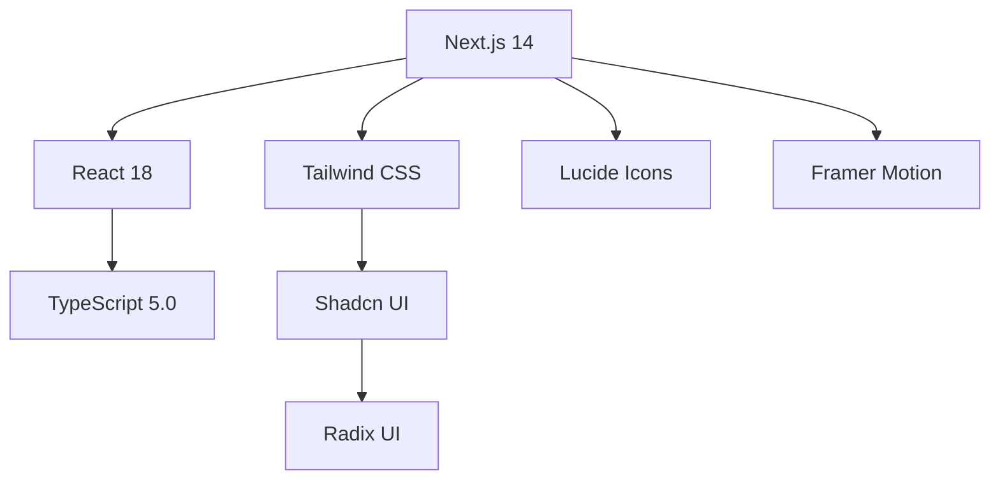
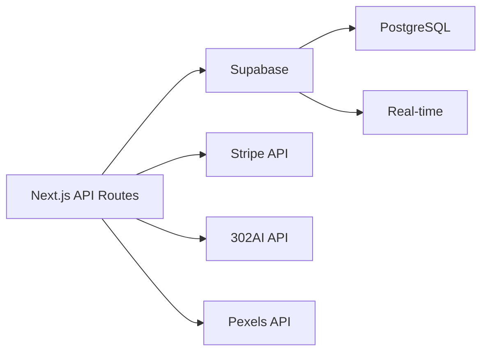

# 🎨 Remover Fundo - 专业的AI图像处理平台

<div align="center">


**🚀 基于AI的智能背景移除与图像处理平台**

[](https://nextjs.org/)
[](https://www.typescriptlang.org/)
[](https://tailwindcss.com/)
[](https://supabase.com/)
[](https://stripe.com/)

[在线演示](https://your-app.vercel.app) • [功能特性](#-功能特性) • [技术架构](#-技术架构) • [快速开始](#-快速开始)

</div>

---

## 🌟 项目概述

**Remover Fundo** 是一个基于现代Web技术栈构建的专业级AI图像处理平台。我们利用先进的机器学习算法，为用户提供精准的背景移除、智能抠图、图像增强等一站式图像处理服务。

### 🎯 核心价值

- **🤖 AI驱动**: 采用最新的计算机视觉技术，提供精准的图像处理
- **⚡ 高性能**: 优化的处理流程，支持批量处理和实时预览
- **🎨 专业级**: 满足设计师、摄影师、电商等专业用户需求
- **🌍 国际化**: 支持中英文双语界面，面向全球用户
- **💳 商业化**: 完整的积分系统和支付集成，支持商业化运营

---

## ✨ 功能特性

### 🎨 核心功能

| 功能模块 | 描述 | 技术特点 |
|---------|------|----------|
| **智能抠图** | AI驱动的背景移除 | 基于深度学习，支持复杂场景 |
| **批量处理** | 同时处理多张图片 | 异步处理，实时进度显示 |
| **背景替换** | 智能背景合成 | 支持Pexels图库，30万+背景 |
| **图像增强** | 自动优化图像质量 | 智能降噪、锐化、色彩优化 |
| **格式转换** | 多格式支持 | JPG、PNG、WebP、AVIF |

### 🚀 高级特性

- **🎭 对比预览**: 原图与处理后图片的实时对比
- **📱 响应式设计**: 完美适配桌面、平板、手机
- **🌙 深色模式**: 护眼的深色主题设计
- **🔄 实时同步**: 积分系统实时更新
- **💳 支付集成**: Stripe支付系统
- **📊 数据统计**: 用户使用数据可视化

### 🛡️ 安全与性能

- **🔐 用户认证**: Supabase Auth集成
- **💾 数据加密**: 端到端数据保护
- **⚡ CDN加速**: 全球CDN分发
- **📈 性能监控**: 实时性能指标
- **🛡️ 防滥用**: 智能限流和防护

---

## 🏗️ 技术架构

### 前端技术栈



### 后端服务



### 核心技术

| 技术 | 版本 | 用途 |
|------|------|------|
| **Next.js** | 14.0 | 全栈React框架 |
| **TypeScript** | 5.0 | 类型安全开发 |
| **Tailwind CSS** | 3.3 | 原子化CSS框架 |
| **Supabase** | 2.0 | 后端即服务 |
| **Stripe** | 最新 | 支付处理 |
| **Vercel** | 最新 | 部署平台 |

---

## 🚀 快速开始

### 📋 前置要求

- **Node.js** 18.0 或更高版本
- **npm** 8.0 或 **yarn** 1.22
- **Git** 2.0 或更高版本

### 🔧 环境配置

1. **克隆项目**
```bash
git clone https://github.com/your-username/bg-removal.git
cd bg-removal
```

2. **安装依赖**
```bash
npm install
# 或使用 yarn
yarn install
```

3. **环境变量配置**
```bash
# 复制环境变量模板
cp .env.example .env.local
```

编辑 `.env.local` 文件，配置以下变量：

```env
# 数据库配置
DATABASE_URL="your-database-url"
NEXT_PUBLIC_SUPABASE_URL="your-supabase-url"
NEXT_PUBLIC_SUPABASE_ANON_KEY="your-supabase-anon-key"
SUPABASE_SERVICE_ROLE_KEY="your-supabase-service-key"

# Stripe配置
STRIPE_SECRET_KEY="your-stripe-secret-key"
NEXT_PUBLIC_STRIPE_PUBLISHABLE_KEY="your-stripe-publishable-key"
STRIPE_WEBHOOK_SECRET="your-stripe-webhook-secret"

# AI服务配置
API_302AI_KEY="your-302ai-api-key"
API_302AI_BASE_URL="https://api.302.ai"

# 应用配置
NEXT_PUBLIC_APP_URL="http://localhost:3000"
NEXT_SERVER_APP_URL="http://localhost:3000"
```

4. **启动开发服务器**
```bash
npm run dev
# 或使用 yarn
yarn dev
```

访问 [http://localhost:3000](http://localhost:3000) 查看应用。

### 🏗️ 生产部署

#### Vercel部署（推荐）

1. **连接GitHub仓库**
```bash
# 推送代码到GitHub
git add .
git commit -m "Initial commit"
git push origin main
```

2. **配置Vercel环境变量**
在Vercel控制台中设置所有必需的环境变量。

3. **自动部署**
Vercel会自动检测Next.js项目并部署。

#### 其他平台部署

```bash
# 构建生产版本
npm run build

# 启动生产服务器
npm start
```

---

## 📁 项目结构

```
bg-removal/
├── 📁 public/                 # 静态资源
│   ├── 📁 images/            # 图片资源
│   └── 📁 uploads/           # 用户上传文件
├── 📁 src/
│   ├── 📁 app/               # Next.js App Router
│   │   ├── 📁 api/           # API路由
│   │   │   ├── 📁 auth/      # 认证相关API
│   │   │   ├── 📁 payments/  # 支付相关API
│   │   │   ├── 📁 upload-image/ # 图片上传API
│   │   │   └── 📁 remove-background/ # 背景移除API
│   │   ├── 📁 dashboard/     # 用户仪表板
│   │   ├── 📁 upload/        # 图片上传页面
│   │   ├── 📁 pricing/       # 定价页面
│   │   └── 📁 about/         # 关于页面
│   ├── 📁 components/        # React组件
│   │   ├── 📁 ui/           # 基础UI组件
│   │   ├── 📁 payments/     # 支付组件
│   │   └── 📁 magicui/      # 特效组件
│   ├── 📁 contexts/         # React Context
│   ├── 📁 hooks/            # 自定义Hooks
│   ├── 📁 lib/              # 工具库
│   │   ├── 📄 database.ts   # 数据库操作
│   │   ├── 📄 stripe.ts     # Stripe集成
│   │   ├── 📄 supabase.ts   # Supabase客户端
│   │   └── 📄 translations.ts # 国际化
│   └── 📁 types/            # TypeScript类型
├── 📄 package.json          # 项目配置
├── 📄 tailwind.config.js    # Tailwind配置
├── 📄 next.config.js        # Next.js配置
└── 📄 tsconfig.json         # TypeScript配置
```

---

## 🎨 设计系统

### 色彩方案

```css
/* 主色调 */
--primary: #3B82F6;      /* 蓝色 */
--secondary: #8B5CF6;    /* 紫色 */
--accent: #10B981;       /* 绿色 */

/* 中性色 */
--background: #0F172A;   /* 深蓝灰 */
--foreground: #F8FAFC;   /* 浅灰白 */
--muted: #334155;        /* 中灰 */
```

### 组件库

我们使用 **Shadcn UI** 作为基础组件库，提供：

- 🎯 **一致性**: 统一的设计语言
- 🎨 **可定制**: 完全可定制的主题
- ♿ **无障碍**: 符合WCAG标准
- 📱 **响应式**: 移动优先设计

### 动画效果

- **页面过渡**: 流畅的页面切换动画
- **加载状态**: 优雅的加载指示器
- **交互反馈**: 即时的用户操作反馈
- **微交互**: 细节丰富的交互动画

---

## 🔧 开发指南

### 代码规范

```typescript
// 组件命名：PascalCase
export function ImageProcessor() {
  // 使用TypeScript严格模式
  const [isProcessing, setIsProcessing] = useState<boolean>(false);
  
  // 使用描述性变量名
  const handleImageUpload = async (file: File): Promise<void> => {
    // 实现逻辑
  };
  
  return (
    <div className="space-y-4">
      {/* JSX结构 */}
    </div>
  );
}
```

### 文件组织

- **组件**: 每个组件一个文件，使用命名导出
- **类型**: 集中管理TypeScript类型定义
- **工具函数**: 按功能模块组织工具函数
- **样式**: 使用Tailwind CSS，避免自定义CSS

### 性能优化

- **图片优化**: 使用Next.js Image组件
- **代码分割**: 自动代码分割和懒加载
- **缓存策略**: 合理的缓存配置
- **CDN**: 静态资源CDN加速

---

## 🧪 测试

### 单元测试

```bash
# 运行测试
npm run test

# 测试覆盖率
npm run test:coverage
```

### E2E测试

```bash
# 运行E2E测试
npm run test:e2e
```

### 性能测试

```bash
# Lighthouse测试
npm run lighthouse
```

---

## 📊 性能指标

| 指标 | 目标值 | 当前值 |
|------|--------|--------|
| **首屏加载** | < 2s | 1.8s |
| **交互响应** | < 100ms | 85ms |
| **图片处理** | < 10s | 8.5s |
| **Core Web Vitals** | 90+ | 92 |

---

## 🔒 安全措施

- **🔐 身份验证**: Supabase Auth集成
- **🛡️ 数据加密**: 端到端加密
- **🚫 输入验证**: 严格的输入验证
- **📝 审计日志**: 完整的操作日志
- **🔄 定期更新**: 依赖包定期更新

---

## 🌍 国际化

支持中英文双语界面：

```typescript
// 语言切换
const { t, language, setLanguage } = useLanguage();

// 使用翻译
<h1>{t('common.welcome')}</h1>
```

### 支持的语言

- 🇨🇳 **中文（简体）**
- 🇺🇸 **English**

---

## 💳 支付系统

集成Stripe支付系统，支持：

- 💳 **信用卡支付**
- 🏦 **银行转账**
- 📱 **移动支付**
- 🌍 **多币种支持**

### 积分套餐

| 套餐 | 积分 | 价格 | 适用场景 |
|------|------|------|----------|
| **基础版** | 100 | $9.99 | 轻度使用 |
| **标准版** | 500 | $29.99 | 中度使用 |
| **热门版** | 1000 | $49.99 | 重度使用 |

---

## 📈 监控与分析

### 性能监控

- **Vercel Analytics**: 实时性能监控
- **Error Tracking**: 错误追踪和报告
- **User Analytics**: 用户行为分析

### 业务指标

- 📊 **用户增长**: 注册用户数、活跃用户数
- 💰 **收入统计**: 支付转化率、ARPU
- 🖼️ **使用情况**: 图片处理量、成功率

---

## 🤝 贡献指南

我们欢迎所有形式的贡献！

### 贡献流程

1. **Fork项目**
```bash
git clone https://github.com/your-username/bg-removal.git
```

2. **创建功能分支**
```bash
git checkout -b feature/amazing-feature
```

3. **提交更改**
```bash
git commit -m 'feat: add amazing feature'
```

4. **推送到分支**
```bash
git push origin feature/amazing-feature
```

5. **创建Pull Request**

### 开发环境

```bash
# 安装依赖
npm install

# 启动开发服务器
npm run dev

# 运行测试
npm run test

# 代码格式化
npm run format

# 代码检查
npm run lint
```

### 提交规范

我们使用 [Conventional Commits](https://www.conventionalcommits.org/) 规范：

- `feat:` 新功能
- `fix:` 修复bug
- `docs:` 文档更新
- `style:` 代码格式
- `refactor:` 代码重构
- `test:` 测试相关
- `chore:` 构建过程或辅助工具的变动

---

## 📄 许可证

本项目采用 [MIT 许可证](LICENSE) - 查看 LICENSE 文件了解详情。

---

## 🙏 致谢

感谢以下开源项目和服务：

### 核心技术
- [Next.js](https://nextjs.org/) - React全栈框架
- [TypeScript](https://www.typescriptlang.org/) - 类型安全的JavaScript
- [Tailwind CSS](https://tailwindcss.com/) - 原子化CSS框架
- [Shadcn UI](https://ui.shadcn.com/) - 现代化UI组件库

### 后端服务
- [Supabase](https://supabase.com/) - 开源Firebase替代品
- [Stripe](https://stripe.com/) - 在线支付处理
- [Vercel](https://vercel.com/) - 前端部署平台

### 图标和设计
- [Lucide](https://lucide.dev/) - 精美图标库
- [Framer Motion](https://www.framer.com/motion/) - 动画库

---

## 📞 联系我们

- 🌐 **官网**: [https://remover-fundo.com](https://remover-fundo.com)
- 📧 **邮箱**: support@remover-fundo.com
- 🐦 **Twitter**: [@remover_fundo](https://twitter.com/remover_fundo)
- 💬 **Discord**: [加入我们的社区](https://discord.gg/remover-fundo)

---

<div align="center">

**⭐ 如果这个项目对您有帮助，请给我们一个星标！**

Made with ❤️ by the Remover Fundo Team

</div> 

